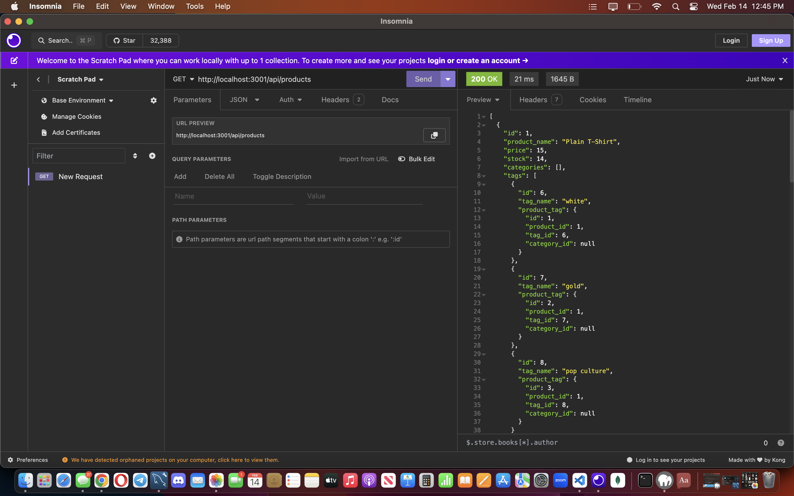

# 13 Object-Relational Mapping (ORM): E-Commerce Back End

## Description

Provide a short description explaining the what, why, and how of your project. Use the following questions as a guide:

- What was your motivation?
  My motivation was to show that I understand how to complete a backend part of a project
- Why did you build this project? (Note: the answer is not "Because it was a homework assignment.")
  I built this project in order to understand how ORM really works for my own understanding
- What problem does it solve?
  The problem it solves is completing the backend aspect of this E-Commerce project
- What did you learn?
  I learned that connecting routes is not as difficult as I thought I just know that I still have a lot to improve on.

## Installation

What are the steps required to install your project? Provide a step-by-step description of how to get the development environment running.

First a github repository needs to be created make sure it has a README.md file, then clone the repository and paste it in your Week 4 folder. Then open the developer folder in the class repository and copy the material inside the folder into the repository folder. Then you can continue work on the assignment.

## Usage

Provide instructions and examples for use. Include screenshots as needed.

To add a screenshot, create an `assets/images` folder in your repository and upload your screenshot to it. Then, using the relative filepath, add it to your README using the following syntax:

    
  
  
  
    

## Credits
CHARLES PUENTE-MATOS ONE OF THE TUTORING TEACHERS ASSISTED ME ON PART OF THIS ASSIGNMENT!
I DID USE YOUTUBE AND OTHER SITES TO HELP ME IMPLEMENT AND COME TO AN UNDERSTANDING OF CODE THAT I AM USING!!!

## User Story

```md
AS A manager at an internet retail company
I WANT a back end for my e-commerce website that uses the latest technologies
SO THAT my company can compete with other e-commerce companies
```

## Acceptance Criteria

```md
GIVEN a functional Express.js API
WHEN I add my database name, MySQL username, and MySQL password to an environment variable file
THEN I am able to connect to a database using Sequelize
WHEN I enter schema and seed commands
THEN a development database is created and is seeded with test data
WHEN I enter the command to invoke the application
THEN my server is started and the Sequelize models are synced to the MySQL database
WHEN I open API GET routes in Insomnia for categories, products, or tags
THEN the data for each of these routes is displayed in a formatted JSON
WHEN I test API POST, PUT, and DELETE routes in Insomnia
THEN I am able to successfully create, update, and delete data in my database
```
---
© 2023 edX Boot Camps LLC. Confidential and Proprietary. All Rights Reserved.
